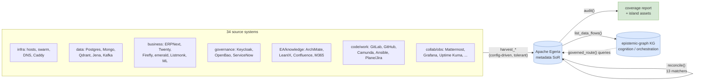
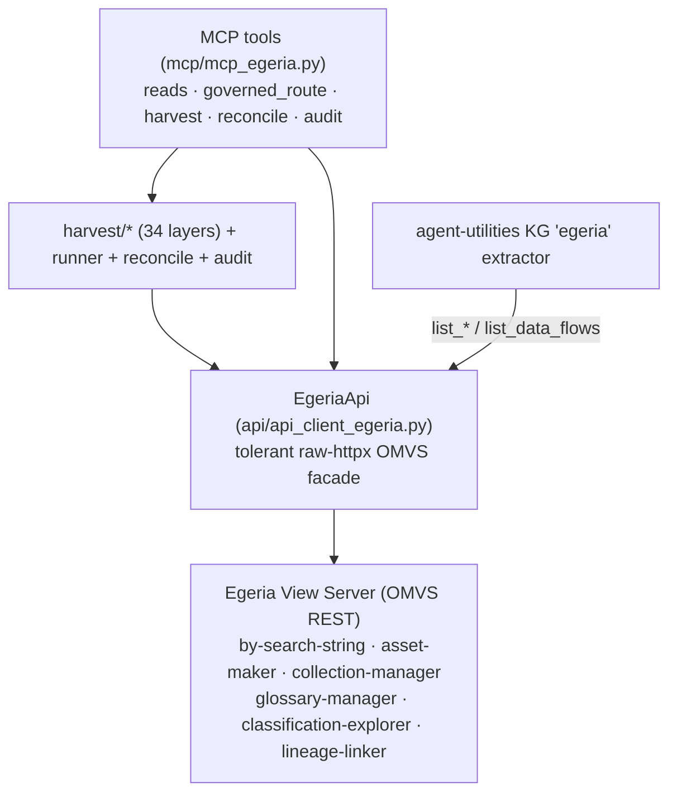
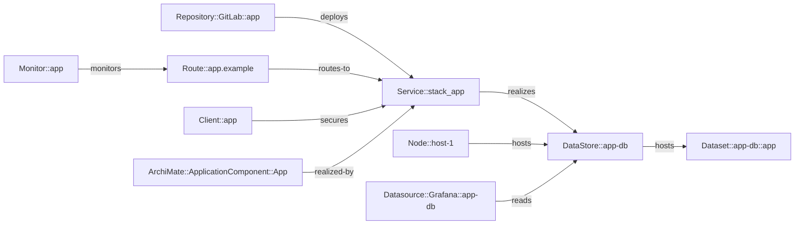
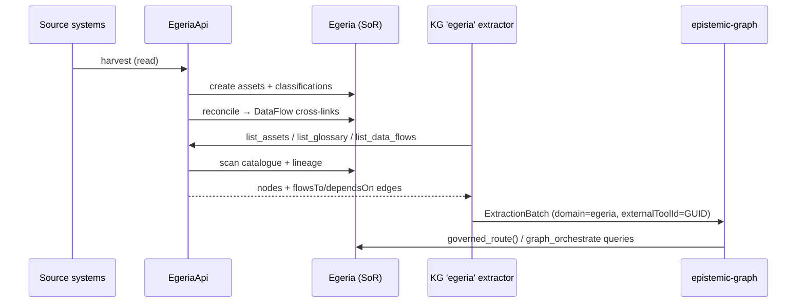

# egeria-mcp Architecture

How the federation fits together: a raw-REST OMVS client, 34 bottom-up harvesters, a
cross-layer reconciliation pass, a completeness audit, and bidirectional federation
with the epistemic-graph knowledge graph.

## The federation pipeline

A full run is **harvest → reconcile → audit**; `governed_route` then queries Egeria
governance + the now-cross-linked lineage to return policy-aware decisions.

## Layered client

No `pyegeria` runtime dependency — the facade speaks REST directly so it runs
identically on Python 3.11–3.14.

## Cross-linked graph (example)

How separately-harvested layers become one graph after `reconcile()`:

`governed_route(DataStore::app-db)` now sees upstream code/ingress and downstream
datasets — cross-layer impact, not an island.

## Bidirectional KG federation

**Invariants:** the KG never becomes the lineage store; Egeria never orchestrates.
Federation key = `externalToolId` (Egeria GUID) + `domain="egeria"` on every node.
Edges: `:flowsTo` (data movement) and `:dependsOn` (structural), defined in
`ontology_egeria.ttl`.
